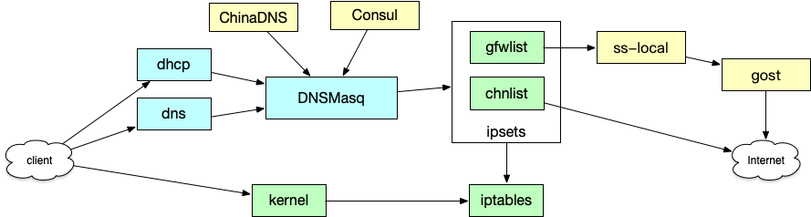

# faure.sh，透明代理配置以及相关脚本

## 概述



## 安装

使用 script/install.sh 安装必要的软件包。同时，编译安装 ss-local 、chinadns 以及 gost 等软件，详见对应的软件包主页（在下方的资源目录中有）。

## 配置

总览：打开 Kernel 的开关，使用 sysctl.conf 的配置；使用 supervisor 运行必要的应用以及后台常驻，以及配置 dnsmasq 配置 dns 以及 dhcp 服务；然后使用 iptables 转发流量。

定时更新以及检查代理服务：参考 `scripts/check.sh` 文件，通常可以配合 crontab 进行定期的代理服务检查以及重启，例如

```crontab
*/10 * * * *	PROXY_ADDR=localhost:1080 $HOME/faure.sh/scripts/check.sh $HOME/faure.sh/scripts/random-pick.sh
```

这样子，每隔十分钟就检查代理是否正确，如果无法连接则选择代理配置并重启代理服务器。

## 资源

- https://github.com/alviezhang/chnroute.git
- https://github.com/ginuerzh/gost
- https://github.com/shadowsocks/ChinaDNS