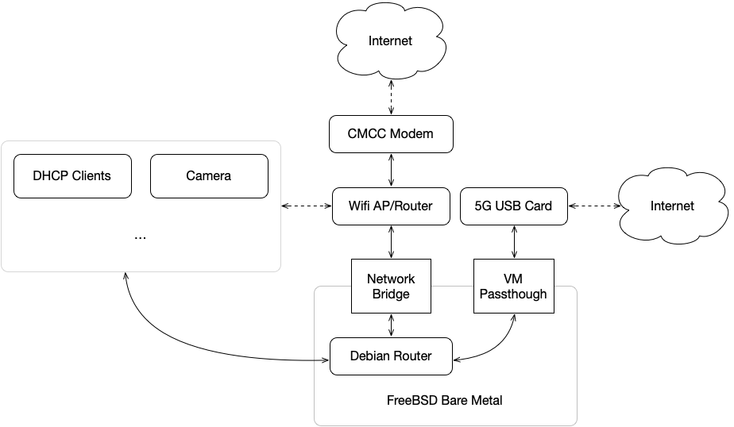
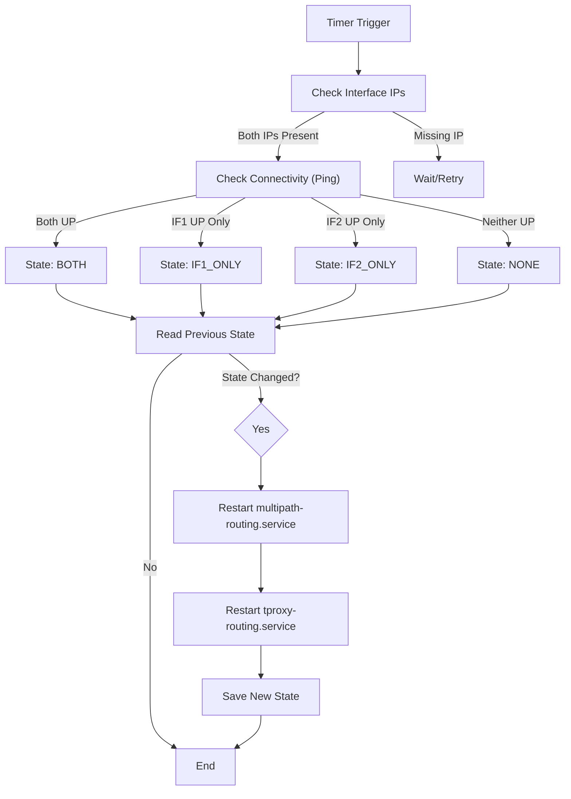

# Faure.sh

**Robust Dual-WAN Load Balancing & Transparent Proxy Solution**

`faure.sh` transforms a Debian/Ubuntu server into a high-availability gateway. It automates Dual-WAN load balancing, transparent proxying (TProxy), and network optimization with self-healing capabilities.



## ✨ Key Features

*   **Dual-WAN Multipath Routing**: Aggregates bandwidth from two uplinks (e.g., Wired `eth0` + USB Tethering `eth1`) with automatic failover.
*   **Self-Healing Connectivity**:
    *   **Hot-plug Support**: Automatically detects interface addition/removal (e.g., USB modem disconnects).
    *   **Boot Resilience**: Waits for network initialization at startup to prevent race conditions.
    *   **Active Monitoring**: The `monitor-uplink` daemon continuously checks connectivity and restores routing tables if dropped.
*   **Transparent Proxy (TProxy)**: Seamlessly redirects TCP/UDP traffic to proxy backends (Clash/Sing-box) using `iptables` and policy routing.
*   **Network Optimization**: Pre-configured with BBR congestion control and high-performance sysctl tunings.
*   **Traffic Management**: Tools to monitor and limit monthly data usage on metered connections.

## 🚀 Quick Start

### Prerequisites
*   Debian Based System (Debian/Ubuntu), RHCL not tested
*   Root privileges, preferably via `sudo`
*   Internet connectivity for initial setup
*   Two network interfaces (physical or virtual)

### Installation

1.  **Clone the Repository**
    ```bash
    git clone https://github.com/your-repo/faure.sh.git /root/faure.sh
    cd /root/faure.sh
    ```

2.  **Run Installer**
    This sets up dependencies, copies configurations, and enables systemd services.
    ```bash
    sudo ./misc_scripts/install.sh
    ```

3.  **Verify Status**
    Check routing tables, rules, and service status.
    ```bash
    sudo ./misc_scripts/verify.sh
    ```


### Configuration

*   **Global Configuration**:
    Edit `scripts/config.sh` to define your network interfaces (`IF1`, `IF2`), LAN subnet (`LAN_NET`), and other routing parameters. This file is the central source of truth for all scripts.

*   **Network Interfaces**:
    Edit `netplan/*.yaml` to match your static/DHCP requirements, then run `netplan apply`.

*   **Traffic Limiting (Optional)**:
    For metered connections (e.g., 4G/5G), add the monitor script to crontab:
    ```bash
    # Check every 5 mins, limit eth1 to 100GB
    */5 * * * * /root/faure.sh/scripts/monitor-traffic-limit.sh eth1 100 80
    ```

## Logic Flow

The following diagram illustrates how `monitor-uplink.sh` maintains connectivity:



## 📂 Core Components

*   **`netplan/*.yaml`**: Network interface configurations.
*   **`systemd/`**: Service and timer unit files for automatic monitoring and routing management.
*   **`misc_scripts/`**: Installation and verification scripts for easy setup and troubleshooting.
*   **`scripts/config.sh`**: Centralized configuration file for interface names, subnets, and routing constants(do not run directly).
*   **`scripts/monitor-uplink.sh`**: The brain of the operation. Monitors WAN health and triggers routing updates.
*   **`scripts/setup-multipath.sh`**: Configures routing tables (100/101), nexthops, and connection marking.
*   **`scripts/setup-tproxy.sh`**: Manages TProxy firewall rules and chains.
*   **`scripts/utils.sh`**: Shared library for logging and network helper functions(do not run directly).
*   **`scripts/verify-network.sh`**: Outputs current routing tables, rules, and interface statuses for debugging.

## License

This project is licensed under the [MIT License](LICENSE), if you have any questions, please contact `mingcheng@apache.org`.
