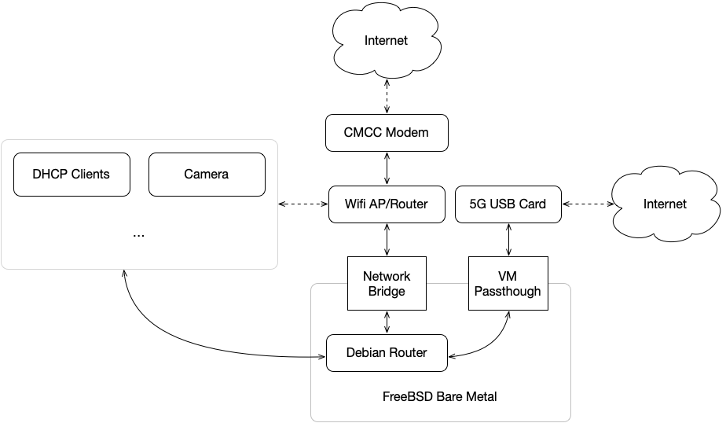
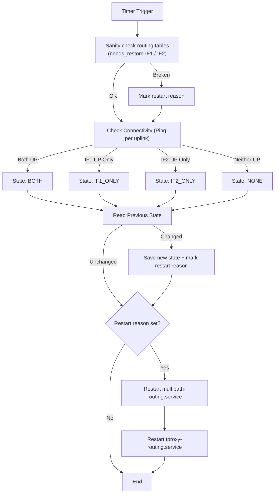

# Faure.sh

**Robust Dual-WAN Load Balancing & Transparent Proxy Solution**

`faure.sh` transforms a Debian/Ubuntu server into a high-availability gateway. It automates Dual-WAN load balancing, transparent proxying (TProxy), and network optimization with self-healing capabilities.



## ✨ Key Features

*   **Dual-WAN Multipath Routing**: Aggregates bandwidth from two uplinks (e.g., Wired `eth0` + USB Tethering `eth1`). Egress mode is selectable per deployment — weighted **balance** (ECMP) or **failover** (active/standby with a configurable primary). Can also run as a one-NIC side-router by disabling the secondary uplink.
*   **Self-Healing Connectivity**:
    *   **Hot-plug Support**: Automatically detects interface addition/removal (e.g., USB modem disconnects).
    *   **Boot Resilience**: Waits for network initialization at startup to prevent race conditions.
    *   **Active Monitoring**: The `monitor-uplink` daemon continuously checks connectivity and restores routing tables if dropped.
*   **Transparent Proxy (TProxy)**: Seamlessly redirects TCP/UDP traffic to proxy backends (Clash/Sing-box) using `iptables` and policy routing.
*   **Tethering Detection Bypass**: Normalizes IPv4 TTL **and** IPv6 Hop-Limit on every WAN egress (default: 65) so carriers cannot fingerprint forwarded traffic by its decremented TTL. Enabled by default, fully togglable via `TTL_BYPASS_ENABLED` / `TTL_BYPASS_VALUE`.
*   **Network Optimization**: Pre-configured with BBR congestion control and high-performance sysctl tunings.
*   **Traffic Management**: Tools to monitor and limit monthly data usage on metered connections.

## 🚀 Quick Start

### Prerequisites

* A fresh Debian-based system (Debian 11+ / Ubuntu 22.04+). RHEL family is not tested.
* Root privileges (the installer must be run with `sudo` or as `root`).
* Outbound Internet connectivity for the package install step.
* One or two network interfaces. Dual-WAN uses `eth0` (LAN/WAN1) + `eth1` (USB tether / WAN2); one-NIC side-router deployments can use only `eth0`.
* Linux kernel **4.9+** (required for BBR and `TPROXY` features).

### Step 1 — Clone the repository

By convention the project lives at `/root/faure.sh`. The installer accepts a custom path as its first argument if you prefer another location.

```bash
sudo git clone https://github.com/mingcheng/faure.sh.git /root/faure.sh
cd /root/faure.sh
```

### Step 2 — Run the installer

The installer is idempotent — re-running it will refresh sysctl/systemd files but **will not** overwrite your local override at `/etc/faure/config.sh`.

```bash
sudo ./install.sh
```

What it does:

1. Installs required packages (`iproute2`, `iptables`, `netplan.io`, `vnstat`, `jq`, …).
2. Copies sysctl tunings from [sysctl.d/](sysctl.d/) into `/etc/sysctl.d/`.
3. Copies systemd units from [systemd/](systemd/) into `/etc/systemd/system/` and enables them (it does **not** start them, so you can edit configuration first).
4. Bootstraps `/etc/faure/config.sh` with a commented template (only on first install).
5. Sets executable bits on the helper scripts under [scripts/](scripts/).

### Step 3 — Configure your environment

`faure.sh` reads its defaults from [scripts/config.sh](scripts/config.sh). To keep the repository upgrade-clean, **do not edit that file directly** — instead override values in one of these locations (first match wins):

| Priority | Path                      | Typical use                          |
| -------: | ------------------------- | ------------------------------------ |
|        1 | `$FAURE_CONFIG` (env var) | Per-invocation testing               |
|        2 | `/etc/faure/config.sh`    | **Recommended** system-wide override |
|        3 | `/etc/default/faure`      | Debian-style alternative             |

Example `/etc/faure/config.sh`:

```bash
export IF1="enp1s0"            # primary uplink
export IF2="enx001122334455"   # secondary uplink (USB tether)
export LAN_NET="192.168.1.0/24"
export MAIN_IP="192.168.1.99"
export TPROXY_PORT="8848"      # must match your Clash/Sing-box listener
export WEIGHT1=1               # multipath weight for IF1
export WEIGHT2=2               # IF2 gets twice the share

# Multi-gateway egress mode (only when BOTH uplinks are UP):
#   balance  - ECMP load balancing using WEIGHT1/WEIGHT2 (default)
#   failover - active/standby; only $PRIMARY_IF is used while it is UP,
#              the other uplink takes over automatically on failure.
export MULTIPATH_MODE="balance"
export PRIMARY_IF="IF1"        # used only when MULTIPATH_MODE=failover

# Tethering / hotspot detection bypass. Defaults are already set in
# scripts/config.sh (enabled, value 65 -- mimics Android tether egress).
# Override only if you need to disable it or pick a different value:
#   65 -- mimics a phone forwarding tethered traffic (recommended).
#   64 -- mimics direct phone egress (no downstream device).
# export TTL_BYPASS_ENABLED=1
# export TTL_BYPASS_VALUE=65
```

For a one-NIC side-router, keep LAN clients and upstream on the same physical NIC and explicitly disable the secondary uplink:

```bash
export IF1="enp1s0"
export IF2=""
export LAN_IF="$IF1"
export LAN_NET="192.168.1.0/24"
export MAIN_IP="192.168.1.99"
```

Any script (setup, monitor, verify) you run will pick the override up automatically.

### Step 4 — Configure netplan (interface IPs)

Adapt the YAML samples in [netplan/](netplan/) to your hardware, copy them into `/etc/netplan/`, then apply:

```bash
sudo cp netplan/90-static.yaml /etc/netplan/
sudo chmod 600 /etc/netplan/90-static.yaml
sudo netplan apply
```

Verify the interfaces obtained their IPs:

```bash
ip -br addr show
```

### Step 5 — (Optional) Bring up your TProxy backend

`setup-tproxy.sh` waits up to ~120s for a listener on `TPROXY_PORT/tcp` and `53/udp`. Make sure your proxy (Clash/Mihomo) is running first. The [compose/](compose/) directory contains ready-to-use Docker Compose stacks, e.g.:

```bash
cd compose/mihomo
sudo docker compose up -d
```

### Step 6 — Start the services

```bash
sudo systemctl start multipath-routing.service
sudo systemctl start tproxy-routing.service
sudo systemctl start monitor-uplink.timer
```

These are also enabled at boot. The dependency graph is:

```
network-online.target
        └── multipath-routing.service   (oneshot)
                  └── tproxy-routing.service  (oneshot, waits for proxy listener)

monitor-uplink.timer  → monitor-uplink.service (every 5 min)
```

### Step 7 — Verify the installation

```bash
sudo ./scripts/verify-network.sh       # routing tables, policy rules, iptables chains, per-uplink connectivity
sudo ./scripts/verify-kernel.sh        # cross-checks every key in sysctl.d/ against the live kernel
```

You should see `[PASS]` for the default route, the active policy rules, and the `MULTIPATH_MARK` / `MIHOMO_TPROXY` chains. In one-NIC mode the verifier skips `IF2`, `MARK2`, `TABLE2`, and priority `101` checks. In `failover` mode the default route is reported as a single nexthop (no `nexthop` keyword) — that is expected.

### Step 8 — (Optional) Limit traffic on a metered link

For a 4G/5G uplink, schedule the traffic monitor via cron or a systemd timer. The script blocks `FORWARD` traffic on the interface once the monthly quota is hit and unblocks it on the 1st of the next month.

```bash
# Check every 5 minutes; warn at 80% of 100 GB on eth1:
*/5 * * * * /root/faure.sh/scripts/monitor-traffic-limit.sh eth1 100 80
```

### Uninstall

```bash
sudo systemctl disable --now multipath-routing.service tproxy-routing.service monitor-uplink.timer
sudo rm /etc/systemd/system/{multipath-routing,tproxy-routing,monitor-uplink}.{service,timer}
sudo rm /etc/sysctl.d/{10,20,30,40,50,99}-*.conf       # only files installed by faure.sh
sudo rm -rf /etc/faure                                  # removes your local overrides
sudo systemctl daemon-reload
```

## Logic Flow

The following diagram illustrates how `monitor-uplink.sh` maintains connectivity:


```mermaid
graph TD
    Start[Timer Trigger] --> SanityCheck["Sanity check routing tables<br/>(needs_restore IF1 / IF2)"]
    SanityCheck -- Broken --> MarkRestart[Mark restart reason]
    SanityCheck -- OK --> CheckConn["Check Connectivity (Ping per uplink)"]
    MarkRestart --> CheckConn

    CheckConn -- Both UP --> StateBoth[State: BOTH]
    CheckConn -- IF1 UP Only --> StateIF1[State: IF1_ONLY]
    CheckConn -- IF2 UP Only --> StateIF2[State: IF2_ONLY]
    CheckConn -- Neither UP --> StateNone[State: NONE]

    StateBoth --> ReadOld[Read Previous State]
    StateIF1 --> ReadOld
    StateIF2 --> ReadOld
    StateNone --> ReadOld

    ReadOld -- Changed --> SaveState[Save new state + mark restart reason]
    ReadOld -- Unchanged --> Decide{Restart reason set?}
    SaveState --> Decide

    Decide -- Yes --> UpdateRoute[Restart multipath-routing.service]
    Decide -- No --> End[End]
    UpdateRoute --> UpdateTProxy[Restart tproxy-routing.service]
    UpdateTProxy --> End
```

## 📂 Core Components

*   **`scripts/config.sh`**: Default configuration file. **Do not edit** — override values from `/etc/faure/config.sh` instead.
*   **`/etc/faure/config.sh`**: User-owned override file, generated on first install and preserved on upgrades.
*   **`scripts/monitor-uplink.sh`**: The brain of the operation. Monitors WAN health and triggers routing updates.
*   **`scripts/setup-multipath.sh`**: Configures routing tables (100/101), nexthops, and connection marking.
*   **`scripts/setup-tproxy.sh`**: Manages TProxy firewall rules and chains.
*   **`scripts/utils.sh`**: Shared library for logging and network helper functions (also responsible for sourcing the override config).
*   **`scripts/verify-network.sh`** / **`scripts/verify-kernel.sh`**: Standalone verifiers for routing/iptables state and for `sysctl.d/` parameters, respectively.

## 🛠 Troubleshooting

| Symptom                                             | First thing to check                                                                                                                                                    |
| --------------------------------------------------- | ----------------------------------------------------------------------------------------------------------------------------------------------------------------------- |
| `multipath-routing.service` fails at boot           | `journalctl -u multipath-routing.service` — usually `IF1`/`IF2` did not get an IP within the 60 s wait window. Verify netplan / DHCP.                                   |
| `tproxy-routing.service` keeps restarting           | The script aborts if no listener is found on `TPROXY_PORT/tcp` and `53/udp`. Start your Clash/Mihomo container first.                                                   |
| Default route disappears after USB modem reconnects | The `monitor-uplink.timer` should restore it within 5 min. Trigger it immediately with `sudo systemctl start monitor-uplink.service`.                                   |
| Carrier still throttles tethered traffic            | Verify the egress rule with `sudo iptables -t mangle -S POSTROUTING \| grep TTL` and `sudo ip6tables -t mangle -S POSTROUTING \| grep HL`. Try `TTL_BYPASS_VALUE=64` (some carriers expect the iOS profile). Confirm with `tcpdump -i <wan> -n -v 'ip[8]=<value>'`. |
| Override file is being ignored                      | Confirm the path is one of `$FAURE_CONFIG`, `/etc/faure/config.sh`, `/etc/default/faure` and that it `export`s the variables. Run `bash -x scripts/config.sh` to trace. |
| Need to roll back routing changes                   | `sudo systemctl stop tproxy-routing.service multipath-routing.service` and reboot, or flush manually with `ip route flush table 100 && ip route flush table 101`.       |

## License

This project is licensed under the [MIT License](LICENSE), if you have any questions, please contact `mingcheng@apache.org`.
